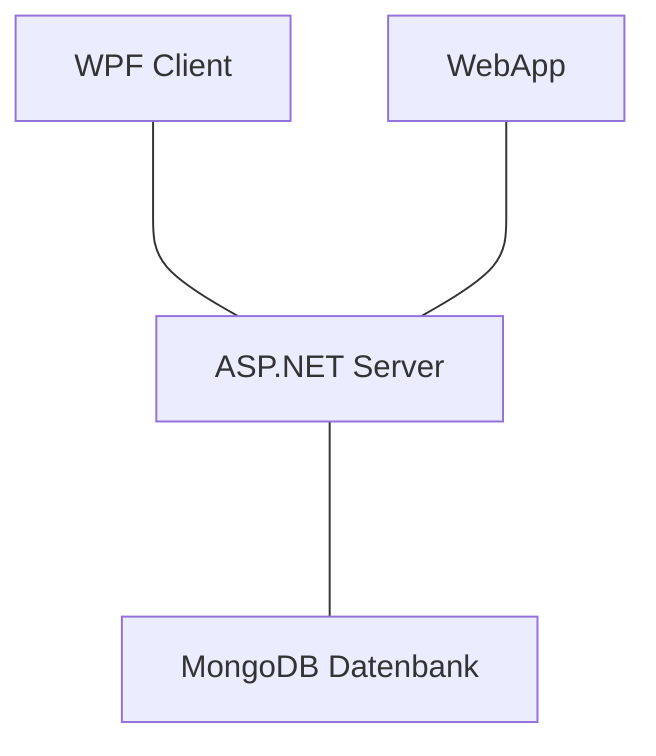
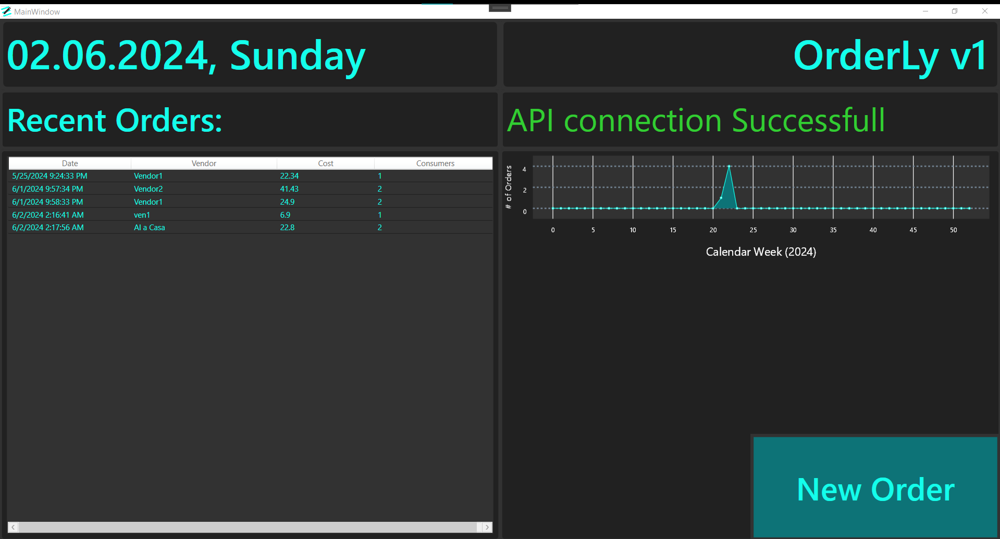
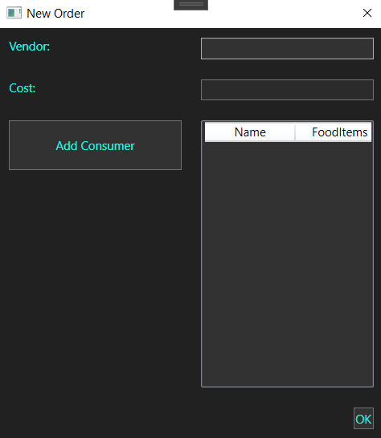
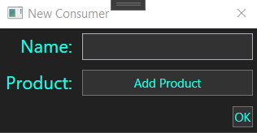
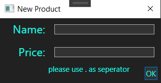
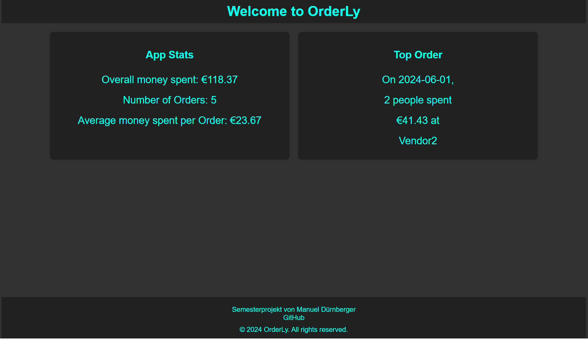
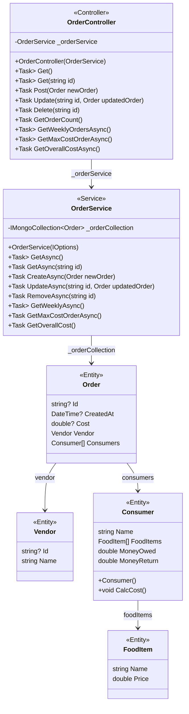

# OrderLy
# Dokumentation Semesterprojekt von Manuel Dürnberger, 4AHINF

## Softwarearchitektur
Das Projekt wurde als Client-Server Anwendung entwickelt, dabei stellen eine WPF-Applikation und eine WebApp die Clients dar. Der Server wird durch eine ASP.Net Core Anwendung umgesetzt. Die Daten werden in einer MongoDB-Datenbank gespeichert.



## Beschreibung der Software
Die App (OrderLy) ermöglicht es Benutzern, Bestellungen zu verfassen um eine Übersicht über die Kosten und häufigkeit zu bekommen. Zum erstellen von Bestellungen wird eine ansprechende Anwendung (WPF) geboten. Ein überblick über einige der Daten wird mittels Web-Anwendung geboten. Die Datenübertragung funktioniert gesichert mittels HTTPS, damit die sicherheit der Daten wärend der Übertragung gewährleistet bleibt.

## Funktionen der Applikation
### Hauptseite
<br>
#### Aktuelles Datum
Links oben wird das derzeitige Datum und der Wochentage angezeigt.<br>
#### Letzte Bestellungen
Links unten werden alle Bestellungen nach Datum sortiert angezeigt.<br>
Dabei werden das **Datum**, der **Anbieter**, die **Gesamtkosten** und die **Anzahl der Konsumenten** angezeigt.<br>
#### Verbindungsstatus mit API
Rechts oben wird der derzeitige **Status der Verbindung** mit der API dargestellt.<br>
Wenn die Verbindung nicht vorhanden ist wird ein erneuter Verbindungsversuch nach fünf Sekunden gestartet.<br>
#### Bestellungen des Jahres nach Woche gruppiert
Rechts mittig werden die **bestellungen pro woche** in einem Graph visuell ansprechend dargestellt.<br>
#### Neue Bestellung erstellen
Rechts unten befindet sich der Knopf zum **erstellen einer neuen Bestellung**.<br>
Wird dieser gedrückt, öffnet sich ein neues Fenster zum eingeben der Daten.

### Neue Bestellung

#### Anbieter
Oben befindet sich ein Eingabefeld für den **Namen des Anbieters** (z.B. "Spasos BBQ").<br>
#### Kosten
Mittig rechts befindet sich ein Feld, das die **aktuellen Kosten** darstellt.<br>
#### Konsument hinzufügen
Links mittig befindet sich der Knopf zum **hinzufügen eines neuen Konsumenten**.<br>
#### Liste der Konsumenten
Rechts mittig befindet sich eine Liste **aller Konsumenten** in der Bestellung.<br>
#### Bestellung abschließen
Rechts unten befindet sich ein Knopf zum **abschließen der Eingabe**.<br>

### Neuer Konsument

#### Name
Oben befindet sich ein Eingabefeld für den **Namen des Konsumenten** (z.B. "Max Mustermann").<br>
#### Produkt hinzufügen
Mittig befindet sich der Knopf zum **hinzufügen eines neuen Produkts**.<br>
#### Konsument abschließen
Rechts unten befindet sich ein Knopf zum **abschließen der Eingabe**.<br>

### Neues Produkt

#### Name
Oben befindet sich ein Eingabefeld für die **Bezeichnung des Produkts** (z.B. "Bosna Klein").<br>
#### Preis
Mittig befindet sich ein Eingabefeld für den **Preis des Produkts** (z.B. "6.40").<br>
#### Produkt abschließen
Rechts unten befindet sich ein Knopf zum **abschließen der Eingabe**.<br>

## Funktionen der Website
### Hauptseite

#### Allgemeine Statistik
Links (auf Mobilgeräten Oben) befinden sich einige Statistiken der Applikation.<br>
Es werden die **Gesamtausgaben aller Bestellungen**, die **Anzahl der Bestellungen** und die **durchschnittlichen Kosten pro Bestellung** angezeigt.<br>
#### Teuerste Bestellung
Rechts (auf Monilgeräten Unten) befindet sich eine Übersicht zur teuersten Bestellung.<br>
Dabei wird das **Datum**, die **Anzahl an Konsumenten**, der **Preis** und der **Anbieter** gezeigt.

## API Beschreibung
Der ASP.NET Server basiert auf dem REST-Prinzip, das ermöglicht es den Clients, Bestellungen zu erstellen, lesen und vieles mehr.

### Endpunkte
<details>
    <summary>/Order [GET]</summary>

 **Beschreibung:** Dieser Endpunkt gibt alle Bestellungen zurück.<br>
 **Return-Wert:**
 200 OK
```json
    [
        {
        "id": "string",
        "createdAt": "2024-06-02T23:18:37.051Z",
        "cost": 0,
        "vendor": {
        "id": "string",
        "name": "string"
        },
        "consumers": [
        {
            "name": "string",
            "foodItems": [
            {
                "name": "string",
                "price": 0
            }
            ],
            "moneyOwed": 0,
            "moneyReturn": 0
        }
        ]
    }
    ]
```
</details>
<details>
    <summary>/Order/{id} [GET]</summary>

**Beschreibung:** Dieser Endpunkt gibt die Bestellung zurück, bei der die ID mit dem Parameter {id} übereinstimmt. Sonst wird der Statuscode 404 zurückgegeben.

**Return-Wert:**
200 OK
```json
{
  "id": "string",
  "createdAt": "2024-06-02T23:38:09.146Z",
  "cost": 0,
  "vendor": {
    "id": "string",
    "name": "string"
  },
  "consumers": [
    {
      "name": "string",
      "foodItems": [
        {
          "name": "string",
          "price": 0
        }
      ],
      "moneyOwed": 0,
      "moneyReturn": 0
    }
  ]
}
```
**Oder:**
404 Not Found
```json
{
  "type": "https://tools.ietf.org/html/rfc9110#section-15.5.5",
  "title": "Not Found",
  "status": 404,
  "traceId": "00-1d67830f405e82a1b4e77dde4477fa7e-635e5b77e669e089-00"
}
```
</details>
<details>
    <summary>/Order [POST]</summary>

**Beschreibung:** Dieser Endpunkt erzeugt eine neue Bestellung, sofern noch nicht vorhanden.

**JSON-Body:**
```json
{
  "vendor": {
    "id": "string",
    "name": "string"
  },
  "consumers": [
    {
      "name": "string",
      "foodItems": [
        {
          "name": "string",
          "price": 0
        }
      ]
    }
  ]
}
```

**Return-Wert:**
201 Created
```json
{
    "id": "string",
    "createdAt": "2024-06-02T23:54:26.6300787Z",
    "cost": 0,
    "vendor": {
        "id": "string",
        "name": "string"
    },
    "consumers": [
        {
            "name": "string",
            "foodItems": [
                {
                    "name": "string",
                    "price": 0
                }
            ],
            "moneyOwed": 0,
            "moneyReturn": 0
        }
    ]
}
```
</details>
<details>
    <summary>/Order/{id} [PUT]</summary>

**Beschreibung:** Dieser Endpunkt ändert/überschreibt die Bestellung bei der die ID mit dem Parameter {id} übereinstimmt, falls vorhanden.

**JSON-Body:**
```json
{
  "id": "string",
  "vendor": {
    "id": "string",
    "name": "string"
  },
  "consumers": [
    {
      "name": "string",
      "foodItems": [
        {
          "name": "string",
          "price": 0
        }
      ],
      "moneyReturn": 0
    }
  ]
}
```

**Return-Wert:**
204 No Content
```json
```
**Oder:**
404 Not Found
```json
{
  "type": "https://tools.ietf.org/html/rfc9110#section-15.5.5",
  "title": "Not Found",
  "status": 404,
  "traceId": "00-1d67830f405e82a1b4e77dde4477fa7e-635e5b77e669e089-00"
}
```
</details>
<details>
    <summary>/Order/{id} [DELETE]</summary>

**Beschreibung:** Dieser Endpunkt entfernt die Bestellung, bei der die ID mit dem Parameter {id} übereinstimmt, falls vorhanden.

**Return-Wert:**
204 No Content
```json
```
**Oder:**
404 Not Found
```json
{
  "type": "https://tools.ietf.org/html/rfc9110#section-15.5.5",
  "title": "Not Found",
  "status": 404,
  "traceId": "00-083daf00755082f1fc11f2e4cfed7eef-27e39aaf1eb062a1-00"
}
```
</details>
<details>
    <summary>/Order/Count [GET]</summary>

**Beschreibung:** Dieser Endpunkt gibt die Anzahl an Bestellungen zurück.

**Return-Wert:**
```json
0
```
</details>
<details>
    <summary>/Order/Weekly [GET]</summary>

**Beschreibung:** Dieser Endpunkt gibt eine Liste aller Wochen des Jahres und deren Bestellungsanzahl mit mindestens einer Bestellung zurück.

**Return-Wert:**
200 OK
```json
[
  {
    "_id": "string",
    "count": 0
  }
]
```
</details>
<details>
    <summary>/Order/MaxCostOrder [GET]</summary>

**Beschreibung:** Dieser Endpunkt gibt die Bestellung mit den größten Kosten zurück.

**Return-Wert:**
200 OK
```json
{
  "id": "string",
  "createdAt": "2024-06-03T00:20:21.569Z",
  "cost": 0,
  "vendor": {
    "id": "string",
    "name": "string"
  },
  "consumers": [
    {
      "name": "string",
      "foodItems": [
        {
          "name": "string",
          "price": 0
        }
      ],
      "moneyOwed": 0,
      "moneyReturn": 0
    }
  ]
}
```
</details>
<details>
    <summary>/Order/OverallCost [GET]</summary>

**Beschreibung:** Dieser Endpunkt gibt die gemeinsamen Kosten aller Bestellungen zurück.

**Return-Wert:**
200 OK
```json
0
```
</details>
<br>
<details>
    <summary>/Vendor [GET]</summary>

 **Beschreibung:** Dieser Endpunkt gibt alle Anbieter zurück.<br>
 **Return-Wert:**
 200 OK
```json
[
  {
    "id": "string",
    "name": "string"
  }
]
```
</details>
<details>
    <summary>/Vendor/{id} [GET]</summary>

**Beschreibung:** Dieser Endpunkt gibt den Anbieter zurück, bei dem die ID mit dem Parameter {id} übereinstimmt. Sonst wird der Statuscode 404 zurückgegeben.

**Return-Wert:**
200 OK
```json
{
  "id": "string",
  "name": "string"
}
```
**Oder:**
404 Not Found
```json
{
  "type": "https://tools.ietf.org/html/rfc9110#section-15.5.5",
  "title": "Not Found",
  "status": 404,
  "traceId": "00-15d2367af6ad6fee2a085f685486d0ec-63189a3970345b8f-00"
}
```
</details>
<details>
    <summary>/Vendor [POST]</summary>

**Beschreibung:** Dieser Endpunkt erzeugt einen neuen Anbieter, sofern noch nicht vorhanden.

**JSON-Body:**
```json
{
  "name": "string"
}
```

**Return-Wert:**
201 Created
```json
{
  "id": "string",
  "name": "string"
}
```
</details>
<details>
    <summary>/Vendor/{id} [PUT]</summary>

**Beschreibung:** Dieser Endpunkt ändert/überschreibt den Anbieter bei dem die ID mit dem Parameter {id} übereinstimmt, falls vorhanden.

**JSON-Body:**
```json
{
  "id": "string",
  "name": "string"
}
```

**Return-Wert:**
204 No Content
```json
```
**Oder:**
404 Not Found
```json
{
  "type": "https://tools.ietf.org/html/rfc9110#section-15.5.5",
  "title": "Not Found",
  "status": 404,
  "traceId": "00-1d67830f405e82a1b4e77dde44f7fa7e-635e5c77e669e089-00"
}
```
</details>
<details>
    <summary>/Vendor/{id} [DELETE]</summary>

**Beschreibung:** Dieser Endpunkt entfernt den Anbieter, bei dem die ID mit dem Parameter {id} übereinstimmt, falls vorhanden.

**Return-Wert:**
204 No Content
```json
```
**Oder:**
404 Not Found
```json
{
  "type": "https://tools.ietf.org/html/rfc9110#section-15.5.5",
  "title": "Not Found",
  "status": 404,
  "traceId": "00-083daf00755082f1fc11f2e4cfed7eef-27e39aaf1eb062a1-00"
}
```
</details>
<details>
    <summary>/Vendor/Count [GET]</summary>

**Beschreibung:** Dieser Endpunkt gibt die Anzahl an Anbietern zurück.

**Return-Wert:**
```json
0
```
</details>

## Verwendung der API

Im folgenden Abschnitt sind die Topologie und Konfiguration, für das hinzufügen einer neuen Bestellung mit Codeausschnitten beschrieben.

## Klassendiagramm

## Codeausschnitte
**Post Funktion in OrderController:**
```csharp
[HttpPost]
public async Task<IActionResult> Post(Order newOrder)
{
    //Set CreatedAt to current time
    newOrder.CreatedAt = DateTime.UtcNow;
    //Calculate overall and consumer costs
    List<Consumer> consumers = [.. newOrder.Consumers];
    foreach (Consumer cs in consumers)
    {
        cs.CalcCost();
        newOrder.Cost += cs.MoneyOwed;
    }
    newOrder.Consumers = consumers.ToArray();

    //Create new Order
    await _orderService.CreateAsync(newOrder);

    return CreatedAtAction(nameof(Get), new { id = newOrder.Id }, newOrder);
}
```
<br>

**Post Funktion in OrderService:**
```csharp
private readonly IMongoCollection<Order> _orderCollection;
public OrderService(
    IOptions<OrderLyDatabaseSettings> orderlyDatabaseSettings)//Gets settings from "appsettings.json"
{
    var mongoClient = new MongoClient(
        orderlyDatabaseSettings.Value.ConnectionString);

    var mongoDatabase = mongoClient.GetDatabase(
        orderlyDatabaseSettings.Value.DatabaseName);

    _orderCollection = mongoDatabase.GetCollection<Order>(
        orderlyDatabaseSettings.Value.OrdersCollectionName);
}
. . . 
//Create new Order
public async Task CreateAsync(Order newOrder) =>
    await _orderCollection.InsertOneAsync(newOrder);
```

**WPF Codeausschnitt:**
```csharp
private async Task<bool> PostNewOrderAsync(Order order)
        {
            try
            {
                var client = new RestClient("https://localhost:7180/api");
                var request = new RestRequest("/Order", Method.Post);
                var JsonString = JsonSerializer.Serialize<Order>(order);
                request.AddParameter("application/json",JsonString,ParameterType.RequestBody);
                var response = await client.ExecuteAsync(request);
                return response.IsSuccessStatusCode;
            }
            catch (HttpRequestException ex)
            {
                MessageBox.Show($"Request error: {ex.Message}");
                return false;
            }
        }
```
<br>
<br>

## Diskussion der Ergebnisse
Nach 2 Monaten, mehreren Tausend Zeilen Code und vielen spannenden Bugs in verschiedensten Programmiersprachen stelle ich die erste Version meins Projekts (OrderLy) vor. Die Anwendung bringt ein ansprechendes und doch funktionelles Design mit sich, was eine einfache bedienung ermöglicht. Die umsetzung eines Clients als WebApp bietet die möglichkeit, auch auf Mobilgeräten mit dem Server zu kommunizieren. Durch die Verwendung von MongoDB ist vor allem die horizontale skalierbarkeit für zukünftige erweiterungen bereits gegeben, was für einen geringeren Wartungsaufwand sorgt.

## Zukunftsausblick
In Zukunft soll das Programm die möglichkeit bieten, Bestellungen zu bearbeiten und löschen. Durch eine neue Umsetzung der Website könnten weitere Metriken der Datenbank erfasst und ansprechend visualisiert werden.

## Quellenverzeichnis
### WPF-Client
#### [WPF Docs](https://learn.microsoft.com/en-us/dotnet/desktop/wpf/overview/?view=netdesktop-8.0)
#### Nuget Pakete
##### [RestSharp](https://www.nuget.org/packages/RestSharp/111.1.0?_src=template)
##### [LiveChartsCore WPF](https://www.nuget.org/packages/LiveChartsCore.SkiaSharpView.WPF/2.0.0-rc2?_src=template)

### ASP.NET-Server
#### [ASP.NET Docs](https://dotnet.microsoft.com/en-us/apps/aspnet)
#### Nuget Pakete
##### [AspNetCore](https://www.nuget.org/packages/Swashbuckle.AspNetCore/6.5.0?_src=template)
##### [MongoDB Driver](https://www.nuget.org/packages/MongoDB.Driver/2.25.0?_src=template)

### MongoDB Datenbank
#### [MongoDB](https://mongodb.com)
#### [C# Docs](https://www.mongodb.com/docs/drivers/csharp/current/)

### WebApp-Client
#### [HTML Docs](https://developer.mozilla.org/en-US/docs/Web/HTML)
#### [CSS Docs](https://developer.mozilla.org/en-US/docs/Web/CSS)
#### [JavaScript Docs](https://developer.mozilla.org/en-US/docs/Web/JavaScript)

### IDE
#### [WebStrom 2024.1](https://www.jetbrains.com/webstorm/download/download-thanks.html?platform=windows)
#### [Visual Studio 2022 17.10.1](https://visualstudio.microsoft.com/de/downloads/)


### API Testing
#### [Postman 11.1.14](https://www.postman.com/)